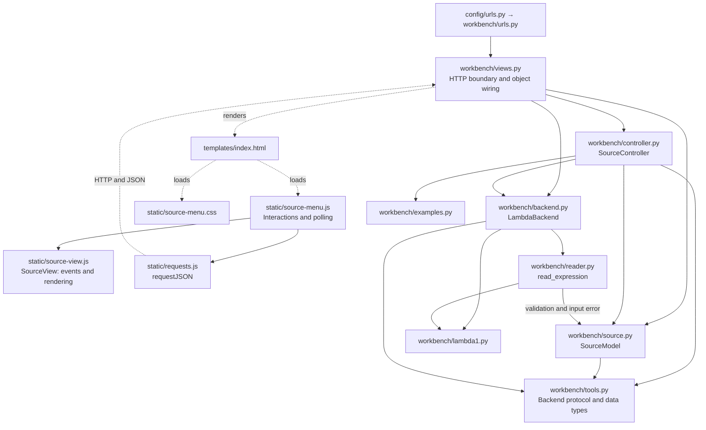

# MVC Architecture

This document describes the Django application in `MySolution/web`. Paths below
are relative to that directory. The controller coordinates the model and the
replaceable language backend. The model owns application state; the view
displays snapshots and forwards interactions.

## Components and dependencies

Solid arrows show imports or calls. Dotted arrows show HTTP communication,
template rendering, or asset loading. The backend methods follow the `Backend`
protocol in `tools.py`; the controller accepts a replacement through its
constructor.

## Responsibilities

| Role | Implementation | Responsibility |
| --- | --- | --- |
| Model | `workbench/source.py`: `SourceModel` | Own applied source/name/revision, draft, results, artifact, and busy state. Validate changes and enforce state rules under a lock. |
| View | `templates/index.html`, `static/source-view.js`: `SourceView`, `static/source-menu.css` | Present labeled controls, editor, status, and results. Forward events and render literal text with `.value` and `.textContent`. |
| Browser coordination | `static/source-menu.js`, `static/requests.js` | Send commands, order draft requests, poll snapshots, reject older responses, and recover from connection loss. Perform no language analysis. |
| Controller | `workbench/controller.py`: `SourceController.command`, `.upload`, `.action` | Decode uploads, select examples, request model transitions, dispatch backend operations, and attach revision/action metadata to results. |
| HTTP boundary | `workbench/views.py`: `index`, `source`, `action`; URL configurations | Render initial state, validate HTTP payloads/versions, enforce CSRF and transport limits, wire objects, and return JSON/status codes. Django calls these functions “views”; they provide the MVC controller's HTTP entry points. |
| Backend adapter | `workbench/backend.py`: `LambdaBackend`, `perform`; `workbench/reader.py` | Read restricted constructor input, call the supplied language functions, classify diagnostics, and bound worker execution. |
| Shared contract | `workbench/tools.py` | Define `Backend`, `BackendReply`, `Outcome`, `Result`, `GeneratedCode`, and `Artifact`, independently of Django. |

The model imports no Django, HTTP, browser, or interpreter code. Accepted source
changes advance `revision` and clear results/artifacts. Rejected changes retain
applied state and keep a corrective draft. Unapplied edits block replacement
and tools; busy work blocks competing changes. These rules also apply to direct
HTTP requests. `version` tracks state changes for request ordering; `revision`
identifies accepted source. One model instance is shared within the local
server process and resets on restart.

## Load source → Lint → Interpret

1. The user uploads a file containing `D0Evar("x")`. The browser sends multipart
   data and the current version to `POST /api/source/`. `views.source` passes
   bytes and filename to `SourceController.upload`.
2. The controller decodes UTF-8 and calls `SourceModel.load`. After validation,
   the model accepts revision 1 and clears old results/artifacts. The returned
   snapshot updates the editor, source name, and revision.
3. Lint sends `{operation: "lint", version: ...}` to `POST /api/action/`.
   `begin_operation` checks applied/clean/idle state and returns the source,
   revision, and job identifier. The controller starts background work; HTTP
   returns 202. The browser disables conflicting controls and polls
   `GET /api/source/`.
4. `LambdaBackend.lint` starts a worker. The reader constructs `D0Evar("x")`;
   `d0exp_fvset` returns `frozenset({"x"})`. The adapter returns
   `language_error`, with `Undeclared variables: 'x'`. The controller stores a
   Lint result for revision 1. Polling displays it and restores controls.
5. Interpret may run independently, including after failed Lint. For this
   source, `d0exp_evaluate(expression, ENVnil())` returns `D0V000()`, which the
   adapter reports as `runtime_error`. No compilation occurs.
6. The user applies `D0Eop2("+", D0Eint(20), D0Eint(22))`. Revision 2 clears
   those results. Lint now reports an empty free-variable set; Interpret returns
   `D0Vint(arg1=42)`. Each result identifies its operation, revision, and outcome.

## Backend contract

`Backend` defines `lint(source)`, `interpret(source)`, `typecheck(source)`,
`compile(source)`, and `execute(artifact)`. Each returns
`BackendReply(outcome, text, free_variables=None, generated_code=None)`.
Lint supplies a `frozenset[str]`; JSON snapshots expose sorted name lists.
Lint never evaluates. Interpret uses the empty environment and treats error
sentinels, including those inside pairs, as runtime errors.

| Outcome | Meaning |
| --- | --- |
| `success` | Real analysis or evaluation completed successfully. |
| `input_error` | Constructor syntax or arguments are invalid. |
| `language_error` | Lint found undeclared variables, listed in sorted order. |
| `runtime_error` | Evaluation raised a language/runtime diagnostic or returned an error sentinel. |
| `backend_failure` | Worker/controller timeout, unexpected exception, or invalid backend reply. |
| `not_implemented` | The requested capability is a placeholder. |

The controller validates replies and creates
`Result(operation, revision, outcome, text, free_variables)`. Model completion
requires the matching operation/revision and active job. Failures release busy
state, preserve source, and allow retry. Source rejection and state conflicts
are separate HTTP errors (400/409); they do not create tool results.

## Two design decisions and tradeoffs

1. **Controller owns backend coordination.** The model handles state without
   language or HTTP dependencies, and tests can inject a backend without
   changing rendering code. The cost is a controller that must manage dispatch,
   result validation, and deadlines. The adapter owns parsing/evaluation; the
   reader reuses the model module's source validation and error type.
2. **Background work with disposable processes and polling.** Real language
   work has a 3-second worker deadline; cleanup can add one second. A separate
   5-second controller watchdog releases busy state and ignores late replies.
   Browser requests also time out after 5 seconds and reconcile through status
   polling. This keeps the page responsive but adds process startup, polling,
   and concurrency handling. A replacement backend must bound and clean up its
   own work; the controller watchdog cannot terminate arbitrary backend threads.

## Replacing the placeholders

Currently Type-check and Compile return `not_implemented` and no generated code.
Execute stays disabled and its backend entry point is also a placeholder.

A future adapter can implement real type checking and compilation behind the
same methods. Successful compilation returns
`GeneratedCode(format: str, code: str)`. The controller already converts it to
`Artifact(revision, format, code)` and the model accepts it only for successful
compilation of the current revision. Execute passes that stored artifact
directly to `backend.execute(artifact)` without recompiling or interpreting
source. Source changes and the start of recompilation invalidate the old
artifact, so failed recompilation leaves Execute unavailable. A real executor
must define supported formats and bound execution. This is a future extension;
test-only compiler artifacts do not implement compilation in the website.
